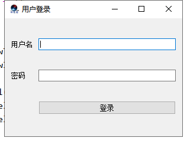
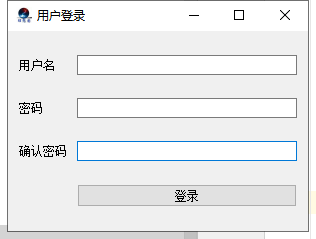

# 理想国PyQT5入门教程


>   作者: 张大鹏
>
>   版权: 归张大鹏个人所有,侵权必究
>
>   报名: 欢迎联系我学习Python,Java,C#,`PHP`,GO等编程
>
>   微信: 18010070052
>
>   抖音: `lxgzhw`
>
>   `GitHub`地址: https://lxgzhw520.com


## 01.快速入门

1.阅读源码

```python
# _*_ coding:UTF-8 _*_
# 开发人员: 理想国真恵玩-张大鹏
# 开发团队: 理想国真恵玩
# 开发时间: 2019/11/19 15:01
# 文件名称: 01快速入门.py
# 开发工具: PyCharm

import sys
from PyQt5.QtWidgets import QApplication, QWidget

if __name__ == '__main__':
    app = QApplication(sys.argv)

    w = QWidget()
    w.resize(250, 150)
    w.move(300, 300)
    w.setWindowTitle('理想国真恵玩')
    w.show()

    sys.exit(app.exec_())
```


2.源码解析

```python
import sys
from PyQt5.QtWidgets import QApplication, QWidget
```

-  这里引入了PyQt5.QtWidgets模块，这个模块包含了基本的组件。 


```python
app = QApplication(sys.argv)
```

-  每个PyQt5应用都必须创建一个应用对象。sys.argv是一组命令行参数的列表。 
-  Python可以在shell里运行，这个参数提供对脚本控制的功能。 


```python
w = QWidget()
```

-  QWidge控件是一个用户界面的基本控件，它提供了基本的应用构造器。默认情况下，构造器是没有父级的，没有父级的构造器被称为窗口（window）。 


```python
w.resize(250, 150)
```

-  resize()方法能改变控件的大小，这里的意思是窗口宽250px，高150px。 


```python
w.move(300, 300)
```

- move()是修改控件位置的的方法。它把控件放置到屏幕坐标的(300, 300)的位置。
-  注：屏幕坐标系的原点是屏幕的左上角。 


```python
w.setWindowTitle('Simple')
```

-  我们给这个窗口添加了一个标题，标题在标题栏展示（虽然这看起来是一句废话，但是后面还有各种栏，还是要注意一下，多了就蒙了）。 


```python
w.show()
```

-  show()能让控件在桌面上显示出来。控件在内存里创建，之后才能在显示器上显示出来。 


```python
sys.exit(app.exec_())
```

-  最后，我们进入了应用的主循环中，事件处理器这个时候开始工作。主循环从窗口上接收事件，并把事件传入到派发到应用控件里。当调用`exit()`方法或直接销毁主控件时，主循环就会结束。`sys.exit()`方法能确保主循环安全退出。外部环境能通知主控件怎么结束。 

- exec_()之所以有个下划线，是因为exec是一个Python的关键字。


## 02.带窗口图标

 1.概念

-   窗口图标通常是显示在窗口的左上角，标题栏的最左边。下面的例子就是怎么用PyQt5创建一个这样的窗口。 

```python
# _*_ coding:UTF-8 _*_
# 开发人员: 理想国真恵玩-张大鹏
# 开发团队: 理想国真恵玩
# 开发时间: 2019/11/19 15:09
# 文件名称: 02窗口图标.py
# 开发工具: PyCharm

import sys
from PyQt5.QtWidgets import QApplication, QWidget
from PyQt5.QtGui import QIcon


class Lxg(QWidget):
    def __init__(self):
        super().__init__()
        self.initUI()

    def initUI(self):
        self.setGeometry(300, 300, 300, 220)
        self.setWindowTitle("理想国真恵玩")
        self.setWindowIcon(QIcon("favicon.ico"))
        self.show()


if __name__ == '__main__':
    app = QApplication(sys.argv)
    lxg = Lxg()
    sys.exit(app.exec_())
```


2.实例解析:

-   前一个例子是使用的过程式编程。Python还支持面向对象的编程：

```python
class Lxg(QWidget):
    def __init__(self):
        super().__init__()
        self.initUI()

    def initUI(self):
        self.setGeometry(300, 300, 300, 220)
        self.setWindowTitle("理想国真恵玩")
        self.setWindowIcon(QIcon("favicon.ico"))
        self.show()
```

-   面向对象编程最重要的三个部分是类(class)、数据和方法。

-   我们创建了一个类的调用，这个类继承自QWidget。这就意味着，我们调用了两个构造器，一个是这个类本身的，一个是这个类继承的。

-   super()构造器方法返回父级的对象。__init__()方法是构造器的一个方法。


```python
self.initUI()
```

-   使用initUI()方法创建一个GUI。


```python
def initUI(self):
    self.setGeometry(300, 300, 300, 220)
    self.setWindowTitle("理想国真恵玩")
    self.setWindowIcon(QIcon("favicon.ico"))
    self.show()
```

-   上面的三个方法都继承自QWidget类。

-   setGeometry()有两个作用：把窗口放到屏幕上并且设置窗口大小。参数分别代表屏幕坐标的x、y和窗口大小的宽、高。也就是说这个方法是resize()和move()的合体。

-   最后一个方法是添加了图标。先创建一个QIcon对象，然后接受一个路径作为参数显示图标。


```python
if __name__ == '__main__':
    app = QApplication(sys.argv)
    lxg = Lxg()
    sys.exit(app.exec_())
```

-    应用和示例的对象创立，主循环开始。 


## 03.提示框

1.关键技术

-   1.1 QToolTip.setFont(QFont("sansSerif", 10))
    -   设置字体的类型和大小
-   1.2 self.setToolTip("这是一个<b>QWidget</b>组件")
    -   设置鼠标移动在上方时的提示信息
-   1.3 btn = QPushButton("按钮", self)
    -   在指定的组件上创建一个按钮
    -   这里是在self上,也就是窗口上
-   1.4 self.setWindowIcon(QIcon("favicon.ico"))
    -   设置窗口的图标
-   1.5 self.setWindowTitle("提示框")
    -   设置窗口的标题
-   1.6 self.setGeometry(300, 300, 300, 200)
    -   设置窗口的位置和大小
    -   btn.resize(btn.sizeHint()) 设置位置
    -   btn.move(50, 50) 设置大小

```python
# _*_ coding:UTF-8 _*_
# 开发人员: 理想国真恵玩-张大鹏
# 开发团队: 理想国真恵玩
# 开发时间: 2019/11/19 15:37
# 文件名称: 03提示框.py
# 开发工具: PyCharm
import sys
from PyQt5.QtWidgets import (QWidget, QToolTip,
                             QPushButton, QApplication)
from PyQt5.QtGui import QFont
from PyQt5.QtGui import QIcon


class LxgApp(QWidget):
    def __init__(self):
        super().__init__()
        self.initUI()

    def initUI(self):
        # 字体
        QToolTip.setFont(QFont("sansSerif", 10))
        # 继承自父类
        self.setToolTip("这是一个<b>QWidget</b>组件")
        # 创建按钮
        btn = QPushButton("按钮", self)
        btn.setToolTip("这是一个<i>QPushButton</i>组件")
        # 设置按钮的大小和位置
        btn.resize(btn.sizeHint())
        btn.move(50, 50)
        # 设置窗口的大小和位置
        self.setGeometry(300, 300, 300, 200)
        # 设置窗口的标题
        self.setWindowTitle("提示框")
        # 设置图标
        self.setWindowIcon(QIcon("favicon.ico"))
        # 显示窗口
        self.show()


if __name__ == '__main__':
    app = QApplication(sys.argv)
    lxg = LxgApp()
    sys.exit(app.exec_())
```


2.代码解析

```python
QToolTip.setFont(QFont("sansSerif", 10))
```

-    这个静态方法设置了提示框的字体，我们使用了10px的SansSerif字体。 


```python
self.setToolTip("这是一个<b>QWidget</b>组件")
```

-   调用setTooltip()创建提示框可以使用富文本格式的内容


```python
btn = QPushButton("按钮", self)
btn.setToolTip("这是一个<i>QPushButton</i>组件")
```

-   创建一个按钮，并且为按钮添加了一个提示框。


```python
btn.resize(btn.sizeHint())
btn.move(50, 50)
```

-   调整按钮大小，并让按钮在屏幕上显示出来，sizeHint()方法提供了一个默认的按钮大小。


## 04.关闭窗口

1.概念

-   关闭一个窗口最直观的方式就是点击标题栏的那个叉，这个例子里，我们展示的是如何用程序关闭一个窗口。这里我们将接触到一点single和slots的知识。

-   本例使用的是QPushButton组件类

```python
QPushButton(string text, QWidget parent = None)
```

-   text参数是想要显示的按钮名称，parent参数是放在按钮上的组件，在我们的 例子里，这个参数是QWidget。应用中的组件都是一层一层（继承而来的？）的，在这个层里，大部分的组件都有自己的父级，没有父级的组件，是顶级的窗口。


2.实战源码

-   关键技术
    -   2.1 qbtn.clicked.connect(QCoreApplication.instance().quit)
        -   给按钮添加点击事件
        -   QCoreApplication.instance().quit
            -   核心App实例的退出方法

```python
# _*_ coding:UTF-8 _*_
# 开发人员: 理想国真恵玩-张大鹏
# 开发团队: 理想国真恵玩
# 开发时间: 2019/11/19 15:54
# 文件名称: 04关闭窗口.py
# 开发工具: PyCharm

import sys
from PyQt5.QtWidgets import QWidget, QPushButton, QApplication, QToolTip
from PyQt5.QtCore import QCoreApplication
from PyQt5.QtGui import QIcon
from PyQt5.QtGui import QFont


class LxgApp(QWidget):
    def __init__(self):
        super().__init__()
        self.initUI()

    def initUI(self):
        # 创建退出按钮
        qbtn = QPushButton("退出", self)
        # 添加点击事件为退出事件
        qbtn.clicked.connect(QCoreApplication.instance().quit)
        # 设置大小和位置
        qbtn.resize(qbtn.sizeHint())
        qbtn.move(50, 50)
        # 设置窗口的大小和位置
        self.setGeometry(300, 300, 250, 150)
        # 设置窗口标题
        self.setWindowTitle("点击退出")
        # 设置窗口图标
        self.setWindowIcon(QIcon("favicon.ico"))
        # 设置退出按钮提示
        QToolTip.setFont(QFont("sansSerif", 10))
        qbtn.setToolTip("点击退出程序")
        # 显示窗口
        self.show()


if __name__ == '__main__':
    app = QApplication(sys.argv)
    lxg = LxgApp()
    sys.exit(app.exec_())
```


3.源码解析

```python
from PyQt5.QtCore import QCoreApplication
```

-   程序需要QtCore对象。


```python
qbtn = QPushButton("退出", self)
```

-   创建一个继承自QPushButton的按钮。第一个参数是按钮的文本，第二个参数是按钮的父级组件，这个例子中，父级组件就是我们创建的继承自Qwidget的LxgApp类。


```python
qbtn.clicked.connect(QCoreApplication.instance().quit)
```

-   事件传递系统在PyQt5内建的single和slot机制里面。
-   点击按钮之后，信号会被捕捉并给出既定的反应。
-   QCoreApplication包含了事件的主循环，它能添加和删除所有的事件，instance()创建了一个它的实例。
-   QCoreApplication是在QApplication里创建的。 点击事件和能终止进程并退出应用的quit函数绑定在了一起。
-   在发送者和接受者之间建立了通讯，发送者就是按钮，接受者就是应用对象。


## 05.消息盒子

1.概念

-   默认情况下，我们点击标题栏的×按钮，QWidget就会关闭。
-   但是有时候，我们修改默认行为。比如，如果我们打开的是一个文本编辑器，并且做了一些修改，我们就会想在关闭按钮的时候让用户进一步确认操作。


2.实战源码

-   关键技术
    -   2.1 QMessageBox.question(self, "消息",
                                             "您确定要退出吗?",
                                             QMessageBox.Yes |
                                             QMessageBox.No,
                                             QMessageBox.No)
        -   参数1 表示绑定给哪个组件
        -   参数2 标题
        -   参数3 内容
        -   参数4 按钮
        -   参数5 默认选择按钮

```python
# _*_ coding:UTF-8 _*_
# 开发人员: 理想国真恵玩-张大鹏
# 开发团队: 理想国真恵玩
# 开发时间: 2019/11/19 16:11
# 文件名称: 05消息盒子.py
# 开发工具: PyCharm

import sys
from PyQt5.QtWidgets import (QWidget, QMessageBox, QApplication,
                             QPushButton, QToolTip)
from PyQt5.QtCore import QCoreApplication
from PyQt5.QtGui import QFont, QIcon


class LxgApp(QWidget):
    def __init__(self):
        super().__init__()
        self.initUI()

    def initUI(self):
        # 设置提示框的字体
        QToolTip.setFont(QFont("sansSerif", 12))
        # 创建一个关闭按钮
        qbtn = QPushButton("退出", self)
        qbtn.resize(qbtn.sizeHint())
        qbtn.move(50, 50)

        # 创建窗口
        self.setGeometry(300, 300, 250, 150)
        self.setWindowTitle("演示消息盒子")
        self.setWindowIcon(QIcon("favicon.ico"))
        self.setToolTip("退出事件")
        self.show()

    def closeEvent(self, event):
        """退出事件"""
        reply = QMessageBox.question(self, "消息",
                                     "您确定要退出吗?",
                                     QMessageBox.Yes |
                                     QMessageBox.No,
                                     QMessageBox.No)
        if reply == QMessageBox.Yes:
            event.accept()
        else:
            event.ignore()


if __name__ == '__main__':
    app = QApplication(sys.argv)
    lxg = LxgApp()
    sys.exit(app.exec_())
```


3.源码解析

-   原理:如果关闭QWidget，就会产生一个QCloseEvent，并且把它传入到closeEvent函数的event参数中。改变控件的默认行为，就是替换掉默认的事件处理。
-   简单的讲,就是重写了父类的closeEvent方法,而这个方法是在关闭窗口的时候执行的


```python
def closeEvent(self, event):
  """退出事件"""
  reply = QMessageBox.question(self, "消息",
                               "您确定要退出吗?",
                               QMessageBox.Yes |
                               QMessageBox.No,
                               QMessageBox.No)
```

-   我们创建了一个消息框，上面有俩按钮：Yes和No.
-   第一个字符串显示在消息框的标题栏，第二个字符串显示在对话框，第三个参数是消息框的俩按钮，最后一个参数是默认按钮，这个按钮是默认选中的。
-   返回值在变量reply里。


```python
if reply == QMessageBox.Yes:
    event.accept()
else:
    event.ignore()
```

-   这里判断返回值，如果点击的是Yes按钮，我们就关闭组件和应用，否者就忽略关闭事件。


## 06.窗口居中

1.实战源码

-   关键技术
    -   1.1 self.frameGeometry()
        -   获得主窗口所在的框架。
    -   1.2 QDesktopWidget().availableGeometry().center()
        -    获取显示器的分辨率，然后得到屏幕中间点的位置。 
    -   1.3 qr.moveCenter(cp)
        -    然后把主窗口框架的中心点放置到屏幕的中心位置。 
    -   1.4 self.move(qr.topLeft())
        -   执行移动

```python
# _*_ coding:UTF-8 _*_
# 开发人员: 理想国真恵玩-张大鹏
# 开发团队: 理想国真恵玩
# 开发时间: 2019/11/19 16:31
# 文件名称: 06窗口居中.py
# 开发工具: PyCharm

import sys
from PyQt5.QtWidgets import QWidget, QDesktopWidget, QApplication
from PyQt5.QtWidgets import QPushButton, QToolTip, QMessageBox
from PyQt5.QtCore import QCoreApplication
from PyQt5.QtGui import QFont, QIcon


class LxgApp(QWidget):
    def __init__(self):
        super().__init__()
        self.initUI()

    def initUI(self):
        # 创建提示框的字体
        QToolTip.setFont(QFont("sansSerif", 12))

        # 创建退出按钮并添加退出事件
        qbtn = QPushButton("退出", self)
        qbtn.setToolTip("点击按钮退出程序")
        qbtn.resize(qbtn.sizeHint())
        qbtn.move(50, 50)
        qbtn.clicked.connect(QCoreApplication.instance().quit)

        # 设置图标,标题,显示窗口
        self.setWindowIcon(QIcon("favicon.ico"))
        self.setWindowTitle("演示窗口居中")
        self.resize(250, 150)  # 大小
        self.center()  # 居中
        self.show()

    def closeEvent(self, event):
        reply = QMessageBox.question(
            self, "退出确认", "您确定要退出吗?",
            QMessageBox.Yes | QMessageBox.No,
            QMessageBox.Yes
        )
        if reply == QMessageBox.Yes:
            event.accept()
        else:
            event.ignore()

    def center(self):
        # 本窗口
        qr = self.frameGeometry()
        # 居中窗口
        cp = QDesktopWidget().availableGeometry().center()
        # 移动本窗口到居中窗口的中心
        qr.moveCenter(cp)
        # 左上角
        self.move(qr.topLeft())


if __name__ == '__main__':
    app = QApplication(sys.argv)
    lxg = LxgApp()
    sys.exit(app.exec_())
```


2.源码解析

```python
self.center()
```

-   这个方法是调用我们下面写的，实现对话框居中的方法。


```python
qr = self.frameGeometry()
```

-   获得主窗口所在的框架。


```python
cp = QDesktopWidget().availableGeometry().center()
```

-   获取显示器的分辨率，然后得到屏幕中间点的位置。


```python
qr.moveCenter(cp)
```

-   然后把主窗口框架的中心点放置到屏幕的中心位置。


```python
self.move(qr.topLeft())
```

-   然后通过move函数把主窗口的左上角移动到其框架的左上角，这样就把窗口居中了。


## 07.状态栏

1.概念

-   QMainWindow提供了主窗口的功能，使用它能创建一些简单的状态栏、工具栏和菜单栏。
-   状态栏是用来显示应用的状态信息的组件。


2.实战源码

-   关键技术
    -   2.1 self.statusBar().showMessage("状态栏")
        -   设置状态栏

```python
# _*_ coding:UTF-8 _*_
# 开发人员: 理想国真恵玩-张大鹏
# 开发团队: 理想国真恵玩
# 开发时间: 2019/11/19 16:54
# 文件名称: 07状态栏.py
# 开发工具: PyCharm

import sys
from PyQt5.QtWidgets import QMainWindow, QApplication
from PyQt5.QtWidgets import QMessageBox, QToolTip
from PyQt5.QtWidgets import QPushButton, QDesktopWidget
from PyQt5.QtCore import QCoreApplication
from PyQt5.QtGui import QIcon, QFont


class LxgApp(QMainWindow):
    def __init__(self):
        super().__init__()
        self.initUI()

    def initUI(self):
        # 创建提示框的字体
        QToolTip.setFont(QFont("sansSerif", 12))

        # 创建退出按钮并添加退出事件
        qbtn = QPushButton("退出", self)
        qbtn.setToolTip("点击按钮退出程序")
        qbtn.resize(qbtn.sizeHint())
        qbtn.move(50, 50)
        qbtn.clicked.connect(QCoreApplication.instance().quit)

        # 状态栏
        # 设置图标,标题,显示窗口
        self.setWindowIcon(QIcon("favicon.ico"))
        self.setWindowTitle("演示状态栏")
        self.statusBar().showMessage("状态栏")
        self.resize(250, 150)
        self.center()
        self.show()

    def closeEvent(self, event):
        reply = QMessageBox.question(
            self, "退出确认", "您确定要退出吗?",
            QMessageBox.Yes | QMessageBox.No,
            QMessageBox.Yes
        )
        if reply == QMessageBox.Yes:
            event.accept()
        else:
            event.ignore()

    def center(self):
        # 本窗口
        qr = self.frameGeometry()
        # 居中窗口
        cp = QDesktopWidget().availableGeometry().center()
        # 移动本窗口到居中窗口的中心
        qr.moveCenter(cp)
        # 左上角
        self.move(qr.topLeft())


if __name__ == '__main__':
    app = QApplication(sys.argv)
    lxg = LxgApp()
    sys.exit(app.exec_())
```


3.源码解析

```python
self.statusBar().showMessage("状态栏")
```

-   状态栏是由QMainWindow创建的。
-   调用QtGui.QMainWindow类的statusBar()方法，创建状态栏。
-   第一次调用创建一个状态栏，返回一个状态栏对象。showMessage()方法在状态栏上显示一条信息。


## 08.菜单栏

1.概念

-   菜单栏是非常常用的。是一组命令的集合（Mac OS下状态栏的显示不一样，为了得到最相似的外观，我们增加了一句menubar.setNativeMenuBar(False))。

```python
# _*_ coding:UTF-8 _*_
# 开发人员: 理想国真恵玩-张大鹏
# 开发团队: 理想国真恵玩
# 开发时间: 2019/11/19 17:36
# 文件名称: 08菜单栏.py
# 开发工具: PyCharm

import sys
from PyQt5.QtWidgets import QMainWindow, QAction, qApp, QApplication
from PyQt5.QtWidgets import QMessageBox, QToolTip, QPushButton
from PyQt5.QtWidgets import QDesktopWidget
from PyQt5.QtCore import QCoreApplication
from PyQt5.QtGui import QIcon, QFont


class LxgApp(QMainWindow):
    def __init__(self):
        super().__init__()
        self.initUI()

    def initUI(self):
        # 设置提示框字体
        QToolTip.setFont(QFont("sansSerif", 12))
        # 添加按钮,监听退出事件,设置提示
        qbtn = QPushButton("退出", self)
        qbtn.setToolTip("点击按钮退出程序")
        qbtn.clicked.connect(QCoreApplication.instance().quit)
        # 设置按钮的大小,位置
        qbtn.resize(qbtn.sizeHint())
        qbtn.move(50, 50)
        # 设置图标,标题
        self.setWindowIcon(QIcon("favicon.ico"))
        self.setWindowTitle("演示菜单栏")

        # 设置状态栏
        self.statusBar().showMessage("状态栏")
        # 设置菜单栏
        exitAct = QAction(QIcon("退出.png"), '&退出', self)
        exitAct.setShortcut("Ctrl+Q")
        exitAct.setStatusTip("退出程序")
        exitAct.triggered.connect(qApp.quit)

        self.statusBar()
        menubar = self.menuBar()
        fileMenu = menubar.addMenu('&文件')
        fileMenu.addAction(exitAct)

        # 设置居中
        self.resize(800, 600)
        self.center()
        self.show()

    def center(self):
        qr = self.frameGeometry()
        cp = QDesktopWidget().availableGeometry().center()
        qr.moveCenter(cp)
        self.move(qr.topLeft())

    # 监听退出事件
    def closeEvent(self, event):
        reply = QMessageBox.question(
            self, "退出确认", "您确定要退出吗?",
            QMessageBox.Yes | QMessageBox.No,
            QMessageBox.No
        )
        if reply == QMessageBox.Yes:
            event.accept()
        else:
            event.ignore()


if __name__ == '__main__':
    app = QApplication(sys.argv)
    lxg = LxgApp()
    sys.exit(app.exec_())
```


2.源码分析

```python
exitAct = QAction(QIcon("退出.png"), '&退出', self)
exitAct.setShortcut("Ctrl+Q")
exitAct.setStatusTip("退出程序")
```

-   QAction是菜单栏、工具栏或者快捷键的动作的组合。
-   前面两行，我们创建了一个图标、一个退出的标签和一个快捷键组合，都执行了一个动作。
-   第三行，创建了一个状态栏，当鼠标悬停在菜单栏的时候，能显示当前状态。


```python
exitAct.triggered.connect(qApp.quit)
```

-   当执行这个指定的动作时，就触发了一个事件。这个事件跟QApplication的quit()行为相关联，所以这个动作就能终止这个应用。


```python
menubar = self.menuBar()
fileMenu = menubar.addMenu('&文件')
fileMenu.addAction(exitAct)
```

-   menuBar()创建菜单栏。这里创建了一个菜单栏，并在上面添加了一个文件菜单，并关联了点击退出应用的事件。


## 09.子菜单

1.概念

-   子菜单是嵌套在菜单里面的二级或者三级等的菜单。


2.实战源码

```python
# _*_ coding:UTF-8 _*_
# 开发人员: 理想国真恵玩-张大鹏
# 开发团队: 理想国真恵玩
# 开发时间: 2019/11/19 19:52
# 文件名称: 09子菜单.py
# 开发工具: PyCharm

import sys
from PyQt5.QtWidgets import QMainWindow, QAction, qApp, QApplication
from PyQt5.QtWidgets import QMessageBox, QToolTip, QPushButton
from PyQt5.QtWidgets import QDesktopWidget, QMenu
from PyQt5.QtCore import QCoreApplication
from PyQt5.QtGui import QIcon, QFont


class LxgApp(QMainWindow):
    def __init__(self):
        super().__init__()
        self.initUI()

    def initUI(self):
        # 提示框和退出按钮
        QToolTip.setFont(QFont("sansSerif", 12))
        exitButton = QPushButton("退出", self)
        exitButton.setToolTip("点击按钮,退出程序")
        exitButton.clicked.connect(QCoreApplication.instance().quit)
        exitButton.resize(exitButton.sizeHint())
        exitButton.move(50, 50)
        # 设置图标和标题
        self.setWindowIcon(QIcon("favicon.ico"))
        self.setWindowTitle("演示子菜单的使用")

        # 设置状态栏
        self.statusBar().showMessage("状态栏")

        # 设置菜单
        # 动作
        exitAction = QAction(QIcon("退出.png"), '&退出', self)
        exitAction.setShortcut("Ctrl+Q")
        exitAction.setStatusTip("退出程序")
        exitAction.triggered.connect(qApp.quit)
        # 菜单栏
        menubar = self.menuBar()
        fileMenu = menubar.addMenu("&文件")
        fileMenu.addAction(exitAction)

        # 子菜单
        impMenu = QMenu("导入", self)
        impAction = QAction("导入邮箱", self)
        impMenu.addAction(impAction)

        # 菜单
        newAction = QAction("新建", self)
        fileMenu.addAction(newAction)
        fileMenu.addMenu(impMenu)

        # 展示窗口
        self.resize(800, 600)
        self.center()
        self.show()

    # 窗口居中
    def center(self):
        frame = self.frameGeometry()
        screenCenter = QDesktopWidget().availableGeometry().center()
        frame.moveCenter(screenCenter)
        self.move(frame.topLeft())

    # 监听退出事件
    def closeEvent(self, event):
        isExit = QMessageBox.question(
            self, "退出确认", "您确定要退出程序吗?",
            QMessageBox.Yes | QMessageBox.No,
            QMessageBox.No
        )
        if isExit == QMessageBox.Yes:
            event.accept()
        else:
            event.ignore()


if __name__ == '__main__':
    app = QApplication(sys.argv)
    lxg = LxgApp()
    sys.exit(app.exec_())
```


3.源码解析

```python
impMenu = QMenu("导入", self)
impAction = QAction("导入邮箱", self)
impMenu.addAction(impAction)
```

-   使用QMenu创建一个新菜单。
-   使用addAction添加一个动作。


```python
fileMenu.addMenu(impMenu)
```

-   使用addMenu添加子菜单


4.关键技术

-   4.1 menubar = self.menuBar()
    -   创建菜单栏
-   4.2 fileMenu = menubar.addMenu("&文件")
    -   创建主菜单
-   4.3 exitAction = QAction(QIcon("退出.png"), '&退出', self)
    -   创建带图标的动作
-   4.4 impMenu = QMenu("导入", self)
    -   创建子菜单
-   4.5 impMenu.addAction(impAction)
    -   给子菜单添加动作
-   4.6 fileMenu.addMenu(impMenu)
    -   给菜单动作添加子菜单


## 10.勾选菜单

1.下面是一个能勾选菜单的例子 

```python
# _*_ coding:UTF-8 _*_
# 开发人员: 理想国真恵玩-张大鹏
# 开发团队: 理想国真恵玩
# 开发时间: 2019/11/19 20:47
# 文件名称: 10勾选菜单.py
# 开发工具: PyCharm
import sys
from PyQt5.QtWidgets import QMainWindow, QDesktopWidget, QApplication
from PyQt5.QtWidgets import QMessageBox, QPushButton, QToolTip
from PyQt5.QtWidgets import QAction, qApp, QMenu
from PyQt5.QtGui import QIcon, QFont
from PyQt5.QtCore import QCoreApplication


class LxgApp(QMainWindow):
    def __init__(self):
        super().__init__()
        self.initUI()

    def initUI(self):
        # 设置按钮和提示框
        QToolTip.setFont(QFont("sansSerif", 12))
        exitButton = QPushButton("退出", self)
        exitButton.setToolTip("点击按钮退出程序")

        # 设置大小和位置
        exitButton.resize(exitButton.sizeHint())
        exitButton.move(50, 50)
        # 点击按钮退出
        exitButton.clicked.connect(QCoreApplication.instance().quit)

        # 设置图标和标题
        self.setWindowIcon(QIcon("favicon.ico"))
        self.setWindowTitle("演示勾选菜单")
        # 状态栏
        self.statusBar().showMessage("状态栏")

        # 添加一级菜单
        exitAction = QAction(QIcon("退出.png"), "&退出", self)
        exitAction.setShortcut("Ctrl+Q")
        exitAction.setStatusTip("退出程序")
        exitAction.triggered.connect(qApp.quit)
        menuBar = self.menuBar()
        fileMenu = menuBar.addMenu("&文件")
        fileMenu.addAction(exitAction)
        # 添加二级菜单
        impMenu = QMenu("导入", self)
        impAction = QAction("导入邮箱", self)
        impMenu.addAction(impAction)
        fileMenu.addMenu(impMenu)

        # 勾选菜单
        viewMenu = menuBar.addMenu("查看")
        viewStatAct = QAction("查看状态栏", self)
        viewStatAct.setCheckable(True)
        viewStatAct.setChecked(True)
        viewStatAct.setStatusTip("查看状态栏")
        viewStatAct.triggered.connect(self.toggleMenu)
        viewMenu.addAction(viewStatAct)

        # 显示窗口
        self.resize(800, 600)
        self.center()
        self.show()

    def toggleMenu(self, state):
        if state:
            self.statusbar.show()
        else:
            self.statusbar.hide()

    def center(self):
        frame = self.frameGeometry()
        screenCenter = QDesktopWidget().availableGeometry().center()
        frame.moveCenter(screenCenter)
        self.move(frame.topLeft())

    # 关闭监听
    def closeEvent(self, event, *args, **kwargs):
        isExist = QMessageBox.question(
            self, "退出确认", "您确定要退出程序吗?",
            QMessageBox.Yes | QMessageBox.No,
            QMessageBox.No
        )
        if isExist == QMessageBox.Yes:
            event.accept()
        else:
            event.ignore()


if __name__ == '__main__':
    app = QApplication(sys.argv)
    lxg = LxgApp()
    sys.exit(app.exec_())
```


2.源码解析


```python
# 勾选菜单
viewMenu = menuBar.addMenu("查看")
viewStatAct = QAction("查看状态栏", self)
viewStatAct.setCheckable(True)
viewStatAct.setChecked(True)
viewStatAct.setStatusTip("查看状态栏")
viewStatAct.triggered.connect(self.toggleMenu)
viewMenu.addAction(viewStatAct)
```

-   用checkable选项创建一个能选中的菜单。
-   默认设置为选中状态。


```python
def toggleMenu(self, state):
  	if state:
    		self.statusbar.show()
    else:
      	self.statusbar.hide()
```

-   依据选中状态切换状态栏的显示与否。 程序预览：


## 11.右键菜单

1.概念

-   右键菜单也叫弹出框（！？），是在某些场合下显示的一组命令。
-   例如，Opera浏览器里，网页上的右键菜单里会有刷新，返回或者查看页面源代码。
-   如果在工具栏上右键，会得到一个不同的用来管理工具栏的菜单。


2.实战源码

```python
# _*_ coding:UTF-8 _*_
# 开发人员: 理想国真恵玩-张大鹏
# 开发团队: 理想国真恵玩
# 开发时间: 2019/11/20 12:42
# 文件名称: 11右键菜单.py
# 开发工具: PyCharm

import sys
from PyQt5.QtWidgets import QMainWindow, QAction, qApp, QApplication
from PyQt5.QtWidgets import QMessageBox, QToolTip, QPushButton
from PyQt5.QtWidgets import QDesktopWidget, QMenu
from PyQt5.QtCore import QCoreApplication
from PyQt5.QtGui import QIcon, QFont


# 主程序
class LxgApp(QMainWindow):
    def __init__(self):
        super().__init__()
        self.initUI()

    def initUI(self):
        # 设置图标和标题
        self.setWindowIcon(QIcon("favicon.ico"))
        self.setWindowTitle("演示右键菜单")

        # 设置按钮,绑定退出事件,设置提示框
        exitButton = QPushButton("退出", self)
        exitButton.setToolTip("点击按钮退出程序")
        exitButton.resize(exitButton.sizeHint())
        exitButton.move(50, 50)
        exitButton.clicked.connect(QCoreApplication.instance().exit)

        # 设置状态栏
        self.statusBar().showMessage("状态栏")

        menuBar = self.menuBar()

        # 设置一级菜单
        exitAction = QAction(QIcon("退出.png"), '&退出', self)
        exitAction.setShortcut("Ctrl+Q")
        exitAction.setStatusTip("退出程序")
        exitAction.triggered.connect(qApp.quit)
        fileMenu = menuBar.addMenu("&文件")
        # 设置二级菜单
        newMenu = QMenu("新建", self)
        newPythonFile = QAction("新建Python文件", self)
        newMenu.addAction(newPythonFile)

        # 将一级菜单和二级菜单添加到文件按钮下
        fileMenu.addMenu(newMenu)
        fileMenu.addAction(exitAction)

        self.resize(800, 600)
        self.center()
        self.show()

    # 菜单栏右键菜单
    def contextMenuEvent(self, QContextMenuEvent):
        rightClickMenu = QMenu(self)
        newAction = rightClickMenu.addAction("新建")
        openAction = rightClickMenu.addAction("打开")
        quitAction = rightClickMenu.addAction("退出")
        # 监听点击动作绑定的事件
        action = rightClickMenu.exec_(self.mapToGlobal(QContextMenuEvent.pos()))
        if action == quitAction:
            qApp.quit()

    # 退出事件
    def closeEvent(self, event, *args, **kwargs):
        isExist = QMessageBox.question(
            self, "退出确认", "您确定要退出程序吗?",
            QMessageBox.Yes | QMessageBox.No,
            QMessageBox.No
        )
        if isExist == QMessageBox.Yes:
            event.accept()
        else:
            event.ignore()

    # 窗口居中
    def center(self):
        frame = self.frameGeometry()
        screenCenter = QDesktopWidget().availableGeometry().center()
        frame.moveCenter(screenCenter)
        self.move(frame.topLeft())


if __name__ == '__main__':
    app = QApplication(sys.argv)
    lxg = LxgApp()
    sys.exit(app.exec_())
```


2.关键技术

```python
# 菜单栏右键菜单
def contextMenuEvent(self, QContextMenuEvent):
    rightClickMenu = QMenu(self)
    newAction = rightClickMenu.addAction("新建")
    openAction = rightClickMenu.addAction("打开")
    quitAction = rightClickMenu.addAction("退出")
    # 监听点击动作绑定的事件
    action = rightClickMenu.exec_(self.mapToGlobal(QContextMenuEvent.pos()))
    if action == quitAction:
      	qApp.quit()
```

```python
action = cmenu.exec_(self.mapToGlobal(event.pos()))
```

-   使用exec_()方法显示菜单。从鼠标右键事件对象中获得当前坐标。mapToGlobal()方法把当前组件的相对坐标转换为窗口（window）的绝对坐标。


```python
if action == quitAction:
  	qApp.quit()
```

-   如果右键菜单里触发了事件，也就触发了退出事件，执行关闭菜单行为。


## 12.工具栏

1.概念

-   菜单栏包含了所有的命令，工具栏就是常用的命令的集合。


2.实战源码

```python
# _*_ coding:UTF-8 _*_
# 开发人员: 理想国真恵玩-张大鹏
# 开发团队: 理想国真恵玩
# 开发时间: 2019/11/20 14:58
# 文件名称: 12工具栏.py
# 开发工具: PyCharm

import sys
from PyQt5.QtWidgets import QMainWindow, QMenu, QAction, qApp, QApplication
from PyQt5.QtWidgets import QMessageBox, QToolTip, QPushButton, QDesktopWidget
from PyQt5.QtCore import QCoreApplication
from PyQt5.QtGui import QIcon, QFont


# 主程序
class LxgApp(QMainWindow):
    def __init__(self):
        super().__init__()
        self.initUI()

    def initUI(self):
        # 设置窗口图标和窗口标题
        self.setWindowTitle("展示工具栏的使用")
        self.setWindowIcon(QIcon("favicon.ico"))

        # 设置提示框字体和大小,添加按钮,绑定提示框和退出事件
        QToolTip.setFont(QFont("sansSerif", 12))
        exitButton = QPushButton("退出", self)
        exitButton.setFont(QFont("sansSerif", 24))
        exitButton.setToolTip("点击退出程序")
        exitButton.resize(exitButton.sizeHint())
        exitButton.move(400, 300)
        exitButton.clicked.connect(QApplication.instance().quit)

        # 设置状态栏
        self.statusBar().showMessage("状态栏")

        # 添加文件->新建->新建Python文件菜单
        menuBar = self.menuBar()
        fileMenu = menuBar.addMenu("&文件")
        fileMenu.addMenu(self.newMenu())

        # 添加文件->退出菜单
        fileMenu.addAction(self.exitAction())

        # 添加工具栏
        self.toolbar = self.addToolBar("退出")
        self.toolbar.addAction(self.exitAction())
        
        self.resize(800, 600)
        self.center()
        self.show()

    # 鼠标右键菜单
    def contextMenuEvent(self, QContextMenuEvent):
        rightClickMenu = QMenu(self)
        newMenu = rightClickMenu.addAction("新建")
        exitAction = rightClickMenu.addAction("退出")
        exitAction1 = rightClickMenu.addAction(self.exitAction())

        # 监听点击事件
        # 右键菜单,这才是关键
        action = rightClickMenu.exec_(self.mapToGlobal(QContextMenuEvent.pos()))
        if action == exitAction:
            qApp.quit()

    # 新建菜单
    def newMenu(self):
        menu = QMenu("新建", self)
        pythonFile = QAction("新建Python文件", self)
        menu.addAction(pythonFile)
        return menu

    # 退出动作
    def exitAction(self):
        exitAction = QAction(QIcon("退出.png"), '&退出', self)
        exitAction.setShortcut("Ctrl+Q")
        exitAction.setStatusTip("退出程序")
        exitAction.triggered.connect(qApp.quit)
        return exitAction

    # 居中
    def center(self):
        frame = self.frameGeometry()
        screenCenter = QDesktopWidget().availableGeometry().center()
        frame.moveCenter(screenCenter)
        self.move(frame.topLeft())


# 测试
if __name__ == '__main__':
    app = QApplication(sys.argv)
    lxg = LxgApp()
    sys.exit(app.exec_())
```


2.关键技术

```python
# 退出动作
def exitAction(self):
    exitAction = QAction(QIcon("退出.png"), '&退出', self)
    exitAction.setShortcut("Ctrl+Q")
    exitAction.setStatusTip("退出程序")
    exitAction.triggered.connect(qApp.quit)
    return exitAction
```

-   这里,我们封装了一个退出动作


```python
# 添加工具栏
self.toolbar = self.addToolBar("退出")
self.toolbar.addAction(self.exitAction())
```

-   把工具类展示出来


## 13.主窗口

1.概念

-    主窗口就是上面三种栏目的总称，现在我们把上面的三种栏在一个应用里展示出来。 


2.实战源码

```python
# _*_ coding:UTF-8 _*_
# 开发人员: 理想国真恵玩-张大鹏
# 开发团队: 理想国真恵玩
# 开发时间: 2019/11/20 16:08
# 文件名称: 13主窗口.py
# 开发工具: PyCharm

import sys
from PyQt5.QtWidgets import QMainWindow, QMenu, QAction, qApp, QApplication
from PyQt5.QtWidgets import QMessageBox, QToolTip, QPushButton, QDesktopWidget
from PyQt5.QtWidgets import QTextEdit
from PyQt5.QtCore import QCoreApplication
from PyQt5.QtGui import QIcon, QFont

from LxgApp import LxgApp


# 主程序
class App(LxgApp):
    def __init__(self):
        super().__init__()
        self.initUI()

    def initUI(self):
        self.setWindowTitle("演示主窗口的使用")
        # 编辑框
        textEdit = QTextEdit()
        self.setCentralWidget(textEdit)
        # 添加菜单栏
        self.getMenuBar()
        # 添加工具栏
        toolbar = self.addToolBar("退出")
        toolbar.addAction(self.getExitAction())
        # 添加状态栏
        self.getStatusBar()

    # 获取状态栏
    def getStatusBar(self):
        self.statusBar().showMessage("状态栏")

    # 获取菜单
    def getMenuBar(self):
        menuBar = self.menuBar()
        fileMenu = menuBar.addMenu("&文件")
        fileMenu.addAction(self.getExitAction())

    # 退出动作
    def getExitAction(self):
        exitAction = QAction(QIcon("exit.png"), "退出", self)
        exitAction.setShortcut("Ctrl+Q")
        exitAction.setStatusTip("退出程序")
        exitAction.triggered.connect(self.close)
        return exitAction


# 测试
if __name__ == '__main__':
    app = QApplication(sys.argv)
    lxg = App()
    sys.exit(app.exec_())
```


3.关键技术

```python
textEdit = QTextEdit()
self.setCentralWidget(textEdit)
```

-    这里创建了一个文本编辑区域，并把它放在`QMainWindow`的中间区域。这个组件或占满所有剩余的区域。 


4.这里,我封装了自己的App类

```python
# _*_ coding:UTF-8 _*_
# 开发人员: 理想国真恵玩-张大鹏
# 开发团队: 理想国真恵玩
# 开发时间: 2019/11/20 16:11
# 文件名称: __init__.py.py
# 开发工具: PyCharm

import sys
from PyQt5.QtWidgets import QMainWindow, QMenu, QAction, qApp, QApplication
from PyQt5.QtWidgets import QMessageBox, QToolTip, QPushButton, QDesktopWidget
from PyQt5.QtCore import QCoreApplication
from PyQt5.QtGui import QIcon, QFont


# 主程序
class LxgApp(QMainWindow):
    def __init__(self):
        super().__init__()
        self.setWindowIcon(QIcon("favicon.ico"))
        self.resize(800, 600)
        self.center()
        self.show()

    # 退出事件
    def closeEvent(self, event, *args, **kwargs):
        isExist = QMessageBox.question(
            self, "退出确认", "您确定要退出程序吗?",
            QMessageBox.Yes | QMessageBox.No,
            QMessageBox.No
        )
        if isExist == QMessageBox.Yes:
            event.accept()
        else:
            event.ignore()

    # 居中
    def center(self):
        frame = self.frameGeometry()
        screenCenter = QDesktopWidget().availableGeometry().center()
        frame.moveCenter(screenCenter)
        self.move(frame.topLeft())
```


## 14.绝对定位

1.概念

-    每个程序都是以像素为单位区分元素的位置，衡量元素的大小。所以我们完全可以使用绝对定位搞定每个元素和窗口的位置。但是这也有局限性： 
    -   元素不会随着我们更改窗口的位置和大小而变化。
    -   不能适用于不同的平台和不同分辨率的显示器
    -   更改应用字体大小会破坏布局
    -   如果我们决定重构这个应用，需要全部计算一下每个元素的位置和大小


2.实战源码

```python
# _*_ coding:UTF-8 _*_
# 开发人员: 理想国真恵玩-张大鹏
# 开发团队: 理想国真恵玩
# 开发时间: 2019/11/20 16:41
# 文件名称: 13绝对定位.py
# 开发工具: PyCharm
import sys
from PyQt5.QtWidgets import QApplication
from PyQt5.QtWidgets import QWidget, QLabel
from LxgApp import LxgApp


class App(LxgApp):
    def __init__(self):
        super().__init__()
        self.initUI()

    def initUI(self):
        label1 = QLabel("理想国", self)
        label1.move(33, 10)
        label2 = QLabel("真恵玩", self)
        label2.move(66, 30)
        label3 = QLabel("张大鹏", self)
        label3.move(99, 60)
        self.setWindowTitle("绝对定位")
        self.show()


if __name__ == '__main__':
    app = QApplication(sys.argv)
    lxg = App()
    sys.exit(app.exec_())
```


2.源码分析

-    我们使用move()方法定位了每一个元素，使用x、y坐标。x、y坐标的原点是程序的左上角。 


```python
label1 = QLabel("理想国", self)
label1.move(33, 10)
label2 = QLabel("真恵玩", self)
label2.move(66, 30)
label3 = QLabel("张大鹏", self)
label3.move(99, 60)
```

-   这个元素的左上角就在这个程序的左上角开始的(33, 10)的位置。


## 15.盒布局

1.概念

-   使用盒布局能让程序具有更强的适应性。这个才是布局一个应用的更合适的方式。 
-   QHBoxLayout和QVBoxLayout是基本的布局类，分别是水平布局和垂直布局。
-   如果我们需要把两个按钮放在程序的右下角，创建这样的布局，我们只需要一个水平布局加一个垂直布局的盒子就可以了。再用弹性布局增加一点间隙。


2.实战源码

```python
# _*_ coding:UTF-8 _*_
# 开发人员: 理想国真恵玩-张大鹏
# 开发团队: 理想国真恵玩
# 开发时间: 2019/11/20 19:17
# 文件名称: 14盒子布局.py
# 开发工具: PyCharm

import sys
from PyQt5.QtWidgets import (QWidget, QPushButton,
                             QHBoxLayout, QVBoxLayout, QApplication)
from LxgApp import LxgApp


class App(QWidget):
    def __init__(self):
        super().__init__()
        self.initUI()

    def initUI(self):
        okButton = QPushButton("确认")
        cancelButton = QPushButton("取消")
        # 创建水平布局盒子
        hbox = QHBoxLayout()
        hbox.addStretch(1)
        hbox.addWidget(okButton)
        hbox.addWidget(cancelButton)

        # 创建垂直布局盒子
        vbox = QVBoxLayout()
        vbox.addStretch(1)
        vbox.addLayout(hbox)

        # 设置布局
        self.setLayout(vbox)

        self.resize(800, 600)
        self.move(300, 300)
        self.setWindowTitle("理想国真恵玩")
        self.show()


if __name__ == '__main__':
    app = QApplication(sys.argv)
    lxg = App()
    sys.exit(app.exec_())
```


3.源码解析

-   上面的例子完成了在应用的右下角放了两个按钮的需求。
-   当改变窗口大小的时候，它们能依然保持在相对的位置。
-   我们同时使用了QHBoxLayout和QVBoxLayout。


```python
okButton = QPushButton("确认")
cancelButton = QPushButton("取消")
```

-   这是创建了两个按钮。


```python
hbox = QHBoxLayout()
hbox.addStretch(1)
hbox.addWidget(okButton)
hbox.addWidget(cancelButton)
```

-    创建一个水平布局，增加两个按钮和弹性空间。
-   stretch函数在两个按钮前面增加了一些弹性空间。
-   下一步我们把这些元素放在应用的右下角。 


```python
vbox = QVBoxLayout()
vbox.addStretch(1)
vbox.addLayout(hbox)
```

-   为了布局需要，我们把这个水平布局放到了一个垂直布局盒里面。
-   弹性元素会把所有的元素一起都放置在应用的右下角。


```python
self.setLayout(vbox)
```

-   最后，我们就得到了我们想要的布局。


## 16.栅格布局

1.概念

-   最常用的还是栅格布局了。
-   这种布局是把窗口分为行和列。
-   创建和使用栅格布局，需要使用QGridLayout模块。


2.实战源码

```python
# _*_ coding:UTF-8 _*_
# 开发人员: 理想国真恵玩-张大鹏
# 开发团队: 理想国真恵玩
# 开发时间: 2019/11/20 19:28
# 文件名称: 15栅格布局.py
# 开发工具: PyCharm
import sys
from PyQt5.QtWidgets import (
    QWidget, QGridLayout, QPushButton, QApplication)


class LxgApp(QWidget):
    def __init__(self):
        super().__init__()
        self.initUI()

    def initUI(self):
        # 设置布局为栅格布局
        grid = QGridLayout()
        self.setLayout(grid)

        names = ['重置', '删除', '', '关闭',
                 '7', '8', '9', '/',
                 '4', '5', '6', '*',
                 '1', '2', '3', '-',
                 '0', '.', '=', '+']

        # i代表行,j代表列 这是一个嵌套循环
        positions = [(i, j) for i in range(5) for j in range(4)]

        for position, name in zip(positions, names):
            print(position, name)
            if name == '':
                continue
            button = QPushButton(name)
            grid.addWidget(button, *position)

        self.move(300, 150)
        self.setWindowTitle("计算器")
        self.show()


if __name__ == '__main__':
    app = QApplication(sys.argv)
    lxg = LxgApp()
    sys.exit(app.exec_())
```


3.源码解析

-   这个例子里，我们创建了栅格化的按钮。


```python
grid = QGridLayout()
self.setLayout(grid)
```

-   创建一个QGridLayout实例，并把它放到程序窗口里。


```python
names = ['重置', '删除', '', '关闭',
         '7', '8', '9', '/',
         '4', '5', '6', '*',
         '1', '2', '3', '-',
         '0', '.', '=', '+']
```

-   这是我们将要使用的按钮的名称。


```python
positions = [(i,j) for i in range(5) for j in range(4)]
```

-   创建按钮位置列表。


```python
for position, name in zip(positions, names):
    print(position, name)
    if name == '':
        continue
        button = QPushButton(name)
        grid.addWidget(button, *position)
```

-   创建按钮，并使用addWidget()方法把按钮放到布局里面。
    -   第一参数是组件
    -   第二个参数是位置(元组)


## 17.留言板

1.概念

-   组件能跨列和跨行展示，这个例子里，我们就试试这个功能。


2.实战源码

```python
# _*_ coding:UTF-8 _*_
# 开发人员: 理想国真恵玩-张大鹏
# 开发团队: 理想国真恵玩
# 开发时间: 2019/11/20 19:40
# 文件名称: 16留言版.py
# 开发工具: PyCharm

import sys

from PyQt5.QtGui import QIcon
from PyQt5.QtWidgets import (
    QWidget, QLabel, QLineEdit, QTextEdit, QGridLayout, QApplication
)


class LxgApp(QWidget):
    def __init__(self):
        super().__init__()
        self.initUI()

    def initUI(self):
        self.setWindowTitle("留言板")
        self.setWindowIcon(QIcon("favicon.ico"))
        # 三个提示文本
        title = QLabel("标题")
        author = QLabel("作者")
        review = QLabel("留言")
        # 三个输入框
        titleEdit = QLineEdit()
        authorEdit = QLineEdit()
        reviewEdit = QTextEdit()

        # 创建栅格布局
        grid = QGridLayout()
        grid.setSpacing(10)

        # 将组建添加到栅格中
        grid.addWidget(title, 1, 0)
        grid.addWidget(author, 2, 0)
        grid.addWidget(review, 3, 0)
        grid.addWidget(titleEdit, 1, 1)
        grid.addWidget(authorEdit, 2, 1)
        grid.addWidget(reviewEdit, 3, 1, 5, 1)

        # 设置布局
        self.setLayout(grid)
        self.resize(800, 600)
        self.move(300, 300)
        self.show()


if __name__ == '__main__':
    app = QApplication(sys.argv)
    lxg = LxgApp()
    sys.exit(app.exec_())
```


3.源码解析

-   我们创建了一个有三个标签的窗口。
-   两个行编辑和一个文本编辑，这是用QGridLayout模块搞定的。


```python
grid = QGridLayout()
grid.setSpacing(10)
```

-   创建标签之间的空间。


```python
grid.addWidget(reviewEdit, 3, 1, 5, 1)
```

-   我们可以指定组件的跨行和跨列的大小。
-   这里我们指定这个元素跨5行显示。


## 18.登录界面

1.需求,设计如图界面




2.实战源码

```python
# _*_ coding:UTF-8 _*_
# 开发人员: 理想国真恵玩-张大鹏
# 开发团队: 理想国真恵玩
# 开发时间: 2019/11/20 19:49
# 文件名称: 17登录界面.py
# 开发工具: PyCharm

import sys
from PyQt5.QtWidgets import (
    QWidget, QLabel, QLineEdit, QTextEdit, QGridLayout, QApplication,
    QToolTip, QPushButton
)
from PyQt5.QtGui import (
    QIcon, QFont,
)


class LxgApp(QWidget):
    def __init__(self):
        super().__init__()
        self.initUI()

    def initUI(self):
        QToolTip.setFont(QFont("sansSerif", 12))
        # 创建栅格布局
        grid = QGridLayout()
        grid.setSpacing(10)

        # 用户名
        username = QLabel("用户名")
        usernameEdit = QLineEdit()
        grid.addWidget(username, 1, 0)
        grid.addWidget(usernameEdit, 1, 1)

        # 密码
        password = QLabel("密码")
        passwordEdit = QLineEdit()
        grid.addWidget(password, 2, 0)
        grid.addWidget(passwordEdit, 2, 1)

        # 登录按钮
        loginButton = QPushButton("登录")
        loginButton.setToolTip("点击登录")
        grid.addWidget(loginButton, 3, 1)

        # 设置窗口布局
        self.setLayout(grid)

        # 窗口
        self.setWindowIcon(QIcon("favicon.ico"))
        self.setWindowTitle("用户登录")
        self.resize(300, 200)
        self.move(300, 300)
        self.show()


if __name__ == '__main__':
    app = QApplication(sys.argv)
    lxg = LxgApp()
    sys.exit(app.exec_())
```


## 19.注册界面

1.需求,设计如图所示页面




2.实战源码

```python
# _*_ coding:UTF-8 _*_
# 开发人员: 理想国真恵玩-张大鹏
# 开发团队: 理想国真恵玩
# 开发时间: 2019/11/20 19:49
# 文件名称: 17登录界面.py
# 开发工具: PyCharm

import sys
from PyQt5.QtWidgets import (
    QWidget, QLabel, QLineEdit, QTextEdit, QGridLayout, QApplication,
    QToolTip, QPushButton
)
from PyQt5.QtGui import (
    QIcon, QFont,
)


class LxgApp(QWidget):
    def __init__(self):
        super().__init__()
        self.initUI()

    def initUI(self):
        QToolTip.setFont(QFont("sansSerif", 12))
        # 创建栅格布局
        grid = QGridLayout()
        grid.setSpacing(10)

        # 用户名
        username = QLabel("用户名")
        usernameEdit = QLineEdit()
        grid.addWidget(username, 1, 0)
        grid.addWidget(usernameEdit, 1, 1)

        # 密码
        password = QLabel("密码")
        passwordEdit = QLineEdit()
        grid.addWidget(password, 2, 0)
        grid.addWidget(passwordEdit, 2, 1)

        # 确认密码
        password1 = QLabel("确认密码")
        password1Edit = QLineEdit()
        grid.addWidget(password1, 3, 0)
        grid.addWidget(password1Edit, 3, 1)

        # 登录按钮
        loginButton = QPushButton("登录")
        loginButton.setToolTip("点击登录")
        grid.addWidget(loginButton, 4, 1)

        # 设置窗口布局
        self.setLayout(grid)

        # 窗口
        self.setWindowIcon(QIcon("favicon.ico"))
        self.setWindowTitle("用户登录")
        self.resize(300, 200)
        self.move(300, 300)
        self.show()


if __name__ == '__main__':
    app = QApplication(sys.argv)
    lxg = LxgApp()
    sys.exit(app.exec_())
```

